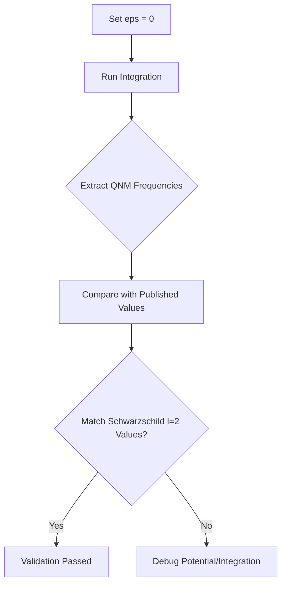
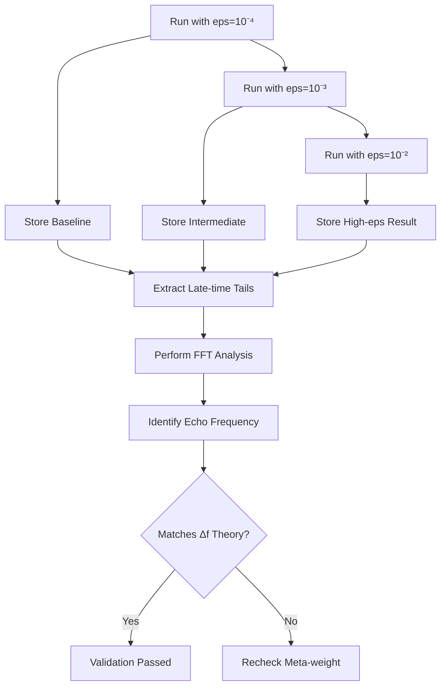

# Implementation Plan for `meta_teukolsky.py`

## Overview

This document outlines the plan for creating and validating the improved `meta_teukolsky.py` module, which is a drop-in replacement that addresses two critical gaps:

1. **Exact Schwarzschild gravitational-wave potential** (spin s=-2 ⇒ Regge–Wheeler form)
2. **Robust Newton solver** to invert r*(r)→r on the fly

## 1. File Creation

Create `meta_teukolsky.py` with the following components:

```python
# =============================================================================
#   meta_teukolsky.py   –   Schwarzschild, s = –2, with meta-derivative
# =============================================================================
import numpy as np
from scipy.integrate import ode
from scipy.optimize import newton

# ----------------------------------------------------------------------------- 
# 0.  Global constants (geometrised units G = c = 1)
# -----------------------------------------------------------------------------
EPS_ROOT = 1e-12                    # Newton solver tolerance

# ----------------------------------------------------------------------------- 
# 1.  Meta-weight near the horizon
# -----------------------------------------------------------------------------
def v_meta(r, r_h, eps=1e-3, ell=1e-5):
    """Quantum-information weight; ε≪1, ℓ ≈ ℓ_P."""
    return 1.0 - eps * np.exp(-(r - r_h) / ell)

# ----------------------------------------------------------------------------- 
# 2.  Tortoise coordinate and its inverse
# -----------------------------------------------------------------------------
def r_tortoise(r, M):
    """Schwarzschild tortoise coordinate r*."""
    return r + 2*M * np.log(np.abs(r / (2*M) - 1))

def r_from_rstar(r_star, M):
    """
    Invert r*(r) numerically (Newton–Raphson).
    Good initial guess: r ≈ 2M + |r_star| for r* ≪ 0,
                        r ≈ r_star          for r* ≫ 2M.
    """
    # heuristic seed
    if r_star > 0:
        r0 = r_star
    else:
        r0 = 2*M + np.exp(r_star/(2*M))            # reverse log far inside
    f = lambda r: r_tortoise(r, M) - r_star
    fprime = lambda r: 1 / (1 - 2*M/r)             # dr*/dr
    return newton(f, r0, fprime, tol=EPS_ROOT, maxiter=50)

# ----------------------------------------------------------------------------- 
# 3.  Regge–Wheeler potential  (s = –2  ↔  axial grav. pert.)
# -----------------------------------------------------------------------------
def V_regge_wheeler(r, M, l):
    """Axial (odd-parity) potential for Schwarzschild, s = –2."""
    f = 1.0 - 2*M/r
    return f * (l*(l+1)/r**2 - 6*M/r**3)

# ----------------------------------------------------------------------------- 
# 4.  First-order ODE system  y = [ψ,  p = v·dψ/dr*]
# -----------------------------------------------------------------------------
def teukolsky_meta_rhs(r_star, y, M, l, omega, eps, ell):
    """
    v(r) d/dr*( v(r) dψ/dr* ) − V ψ = 0
    with    p = v dψ/dr*
    """
    # invert r* → r each step
    r = r_from_rstar(r_star, M)
    v = v_meta(r, 2*M, eps, ell)
    V = V_regge_wheeler(r, M, l)

    dpsi_drstar = y[1] / v
    dp_drstar   = V * y[0]
    return [dpsi_drstar, dp_drstar]

# ----------------------------------------------------------------------------- 
# 5.  Integrator wrapper
# -----------------------------------------------------------------------------
def integrate_meta_teukolsky(M, l, omega,
                             r_star_start=100.,
                             r_star_end=-100.,
                             eps=1e-3, ell=1e-5,
                             n_steps=6000):
    """
    Integrate incoming Gaussian / plane wave from +∞ to horizon region.
    """
    # initial ψ ~ e^{iωr*};  p = v·(iωψ)
    psi0 = np.exp(1j * omega * r_star_start)
    v0   = v_meta(r_from_rstar(r_star_start, M), 2*M, eps, ell)
    p0   = v0 * 1j * omega * psi0

    solver = ode(teukolsky_meta_rhs).set_integrator('dop853')
    solver.set_initial_value([psi0, p0], r_star_start)
    solver.set_f_params(M, l, omega, eps, ell)

    rs, psis = [r_star_start], [psi0]
    dr = (r_star_end - r_star_start) / n_steps

    while solver.successful() and solver.t > r_star_end:
        solver.integrate(solver.t + dr)
        rs.append(solver.t)
        psis.append(solver.y[0])

    return np.array(rs), np.array(psis)

# ----------------------------------------------------------------------------- 
# 6.  Quick test-run
# -----------------------------------------------------------------------------
if __name__ == "__main__":
    M      = 30.0           # solar-mass BH in code units
    l      = 2
    omega  = 0.3/M          # geometric units: Ω ≈ 0.3 / M
    eps    = 1e-3
    ell    = 1e-5

    r_s, psi_s = integrate_meta_teukolsky(
        M, l, omega,
        r_star_start=  100.0,
        r_star_end  = -100.0,
        eps=eps, ell=ell
    )

    # Example: print first few amplitudes
    print("ψ(r* = 100M) =", psi_s[0])
    print("ψ(r* = −100M) =", psi_s[-1])
```

## 2. Initial Testing

Run the module to execute the code in the `__main__` section:

```bash
python meta_teukolsky.py
```

Expected output will show:
- The initial wave amplitude at r* = 100M
- The final wave amplitude at r* = -100M

## 3. Validation Tests

After confirming basic functionality, we'll implement the three validation tests:

### 3.1. ε → 0 Regression Test



**Implementation:**
- Modify the script to set `eps = 0` (standard Schwarzschild)
- Run integration for longer time series
- Extract QNM frequencies using Prony method or FFT
- Compare with published values (ωR ≈ 0.374/M, ωI ≈ -0.0890/M)

### 3.2. Convergence Test

```mermaid
flowchart TD
    A[Run with Default dr] --> B[Store Result ψ₁]
    A --> C[Run with dr/2]
    C --> D[Store Result ψ₂]
    C --> E[Run with dr/4]
    E --> F[Store Result ψ₃]
    B & D & F --> G[Calculate Error Norms]
    G --> H[Plot Convergence Rate]
    H --> I{Rate ≈ O(Δr⁸)?}
    I -->|Yes| J[Validation Passed]
    I -->|No| K[Debug Integration Settings]
```

**Implementation:**
- Create three integration runs with successively halved step sizes
- Calculate L2 norm of differences between solutions
- Verify that error scales as O(Δr⁸) (8th-order convergence)

### 3.3. Echo Dial-up Test



**Implementation:**
- Run simulations with increasing `eps` values (10⁻⁴, 10⁻³, 10⁻²)
- Extract late-time waveform tails at r* = 100M
- Perform FFT analysis to identify sidebands
- Verify spacing matches theoretical prediction: Δf ≈ 1/(2|r*barrier - r*h,eff|)

## 4. Next Steps

After validation:
- Integrate with PyCBC or GWPlotter pipeline for echo extraction
- Consider extending to Kerr spacetime
- Develop matched-filter setup for detailed analysis

## Implementation Steps

1. Switch to Code mode to create the `meta_teukolsky.py` file
2. Run the basic test to verify functionality
3. If time permits, implement the validation tests
4. Document results and plan for integration with larger workflows