# Landing Page Generator

A comprehensive 6-phase SOP for AI-driven landing page creation, from research to deployment. Converts product/service briefs into high-converting, deployable landing pages using evidence-based design patterns and conversion psychology.

## Overview

Landing Page Generator represents a systematic approach to creating landing pages that actually convert. Rather than generating generic templates, it employs a research-driven methodology that ensures every page is optimized for its specific audience, product, and conversion goal.

This skill draws inspiration from direct response marketing principles--understanding that a landing page is not just a website, but a carefully crafted argument that guides visitors toward a single action. The 6-phase workflow mirrors how professional conversion rate optimization (CRO) teams work: research the market, craft compelling copy, gather design inspiration, build with purpose, iterate based on feedback, and deploy with confidence.

**Key Innovation**: This skill combines:
- **Web research** for current best practices and conversion tactics
- **Structured copywriting** using proven frameworks (AIDA, PAS, FAB)
- **Design system extraction** via Firecrawl for brand consistency
- **Multi-model code generation** using highest-capability models
- **Context-aware iteration** to prevent quality degradation
- **Automated deployment** via Netlify CLI

The result is landing pages that don't just look good--they convert visitors into customers.

## Core Principles

Landing Page Generator operates on five fundamental principles that ensure every page achieves its conversion goal:

### Principle 1: Copy Before Design

The words on the page matter more than how it looks. A well-written page with mediocre design will outperform a beautiful page with weak copy. This is why Phase 2 (Copy) comes before Phase 3 (Inspiration) and Phase 4 (Build).

In practice:
- Always complete copy review before moving to design
- Never let design decisions compromise copy clarity
- Test copy with the "squint test"--if you squint, can you still understand the hierarchy?
- Headlines should stand alone as complete value propositions

### Principle 2: One Page, One Goal

Every landing page should have exactly one conversion goal. Multiple CTAs, competing messages, or confusing navigation kill conversions. The page exists to drive one specific action.

In practice:
- Define the single desired action before starting
- Remove anything that doesn't support that action
- Use the "newspaper test"--could someone scanning for 5 seconds understand what to do?
- Secondary CTAs (like "Learn More") should be visually subordinate

### Principle 3: Research-Driven, Not Assumption-Driven

What worked last year may not work today. Landing page best practices evolve constantly. Phase 1 (Research) ensures every page is built on current, evidence-based tactics rather than outdated assumptions.

In practice:
- Always emphasize "as of today's date" in research prompts
- Look for specific conversion rate data, not just design trends
- Research competitor landing pages for inspiration and differentiation
- Update the playbook regularly as tactics evolve

### Principle 4: Inspiration, Not Imitation

Extracting branding from inspiration sites creates consistency, not copycats. The goal is to capture design systems (colors, fonts, spacing) while maintaining unique value propositions and messaging.

In practice:
- Use Firecrawl for objective branding data, not subjective "feel"
- Screenshots capture layout patterns, not copy to replicate
- Adapt inspiration to your brand, don't adopt it wholesale
- Multiple inspiration sources prevent single-source bias

### Principle 5: Iterate in the Right Environment

AI context windows have limits. After 2-3 iterations, quality degrades as the context fills. Moving to dedicated coding environments (like Cursor) preserves quality during extensive refinement.

In practice:
- Track iteration count explicitly
- Export to Cursor after iteration 2-3
- Use element selection for surgical changes
- Each Cursor iteration = fresh, focused context

## MCP Requirements

```yaml
mcp_servers:
  required:
    - memory-mcp  # Store research, copy, learnings
  optional:
    - playwright  # For screenshot capture
    - flow-nexus  # For advanced scraping
```

**Why These MCPs**:
- **memory-mcp**: Stores research playbooks for reuse, tracks successful patterns, enables learning across projects
- **playwright**: Enables programmatic full-page screenshots when manual capture isn't practical
- **flow-nexus**: Advanced scraping capabilities for complex inspiration sites


## When to Use This Skill

**Use When:**
- Creating landing pages for new products/services
- Building marketing pages for campaigns
- Generating sales pages with conversion focus
- Need rapid prototyping of web presence
- Want AI-assisted copywriting with design

**Do Not Use When:**
- Building complex multi-page applications (use `feature-dev-complete`)
- Need custom CMS integration (use `backend-api-development`)
- Require e-commerce checkout flows (use specialized e-commerce skills)


## The 6-Phase SOP

### Phase 1: Research (15-30 min)

**Purpose**: AI researches current landing page best practices, conversion tactics, and design trends.

**Agent**: `researcher`

**Prompt Template**:
```
Research the best practices for creating highly converting landing pages as of {TODAY_DATE}.

Focus areas:
- Copywriting tactics (headlines, CTAs, social proof)
- Landing page structure (hero, problem, solution, testimonials, CTA)
- Styling and color psychology
- Mobile responsiveness requirements
- Current conversion rate benchmarks

Include any other areas critical for landing page success.

Output: Render as markdown artifact titled "Landing Page Playbook"
```

**Input Contract**:
```yaml
required:
  - today_date: string  # Current date for recency
optional:
  - industry: string  # Industry-specific research
  - target_audience: string  # Audience demographics
```

**Output Contract**:
```yaml
required:
  - playbook_markdown: string  # Best practices document
  - key_findings: list  # Top 5-10 actionable insights
```

**Evidence-Based Techniques**:
- Self-consistency: Cross-validate across multiple sources
- Recency emphasis: Date-specific queries prevent stale tactics


### Phase 3: Inspiration (10-20 min)

**Purpose**: Gather design inspiration from existing websites via branding extraction and screenshots.

**Agents**: `researcher`, `frontend-performance-optimizer`

**Two Sub-Tasks**:

#### 3A: Branding Extraction (Firecrawl)

```bash
# Use helper script
node resources/scripts/firecrawl-scraper.js {INSPIRATION_URL}
```

**Script Output**: `branding.json` containing:
- Color palette (primary, secondary, accent)
- Typography (fonts, sizes, weights)
- Button styles (shapes, hover states)
- Spacing patterns
- Image treatment

#### 3B: Full-Page Screenshot

```bash
# Use helper script
node resources/scripts/screenshot-capture.js {INSPIRATION_URL}
```

**Script Output**: `inspiration-screenshot.png` - Full-page capture for visual reference

**Input Contract**:
```yaml
required:
  - inspiration_url: string  # Website to extract from
optional:
  - existing_brand_url: string  # Your own site for consistency
  - additional_inspiration: list  # Multiple URLs
```

**Output Contract**:
```yaml
required:
  - branding_json: file  # Firecrawl extraction
  - screenshot_png: file  # Full-page capture
```


### Phase 5: Iterate (Variable)

**Purpose**: Refine the landing page through targeted iterations using code-focused tooling.

**Agent**: `coder`, `reviewer`

**Strategy**: After 1-2 iterations in chat, move to dedicated coding environment to prevent context degradation.

**In-Chat Iterations (1-2 max)**:
```
Make these specific changes to the landing page:
1. {CHANGE_1}
2. {CHANGE_2}

Preserve all existing functionality and copy.
```

**Cursor/External IDE Iterations (3+)**:

```bash
# Download HTML from artifact
# Open in Cursor with browser preview

# Use element selection for targeted edits:
# 1. Open browser preview in Cursor
# 2. Click "Select Element" tool
# 3. Click on section to modify
# 4. Describe changes in chat
```

**Input Contract**:
```yaml
required:
  - current_html: file  # Current landing page
  - changes_requested: list  # Specific modifications
optional:
  - iteration_number: integer  # Track iteration count
  - section_focus: string  # Specific section to modify
```

**Output Contract**:
```yaml
required:
  - updated_html: file  # Modified landing page
  - changes_log: list  # What was changed
```

**Context Preservation**: After 2 iterations, export HTML and continue in fresh context or external tool.


## Agent Mapping

| Phase | Primary Agent | Backup Agent | Capabilities Required |
|-------|---------------|--------------|----------------------|
| 1. Research | `researcher` | `analyst` | web-research, synthesis |
| 2. Copy | `content-writer` | `coder` | copywriting, marketing |
| 3. Inspiration | `researcher` | `frontend-dev` | scraping, screenshot |
| 4. Build | `coder` | `frontend-dev` | HTML/CSS/JS, design |
| 5. Iterate | `coder` | `reviewer` | refactoring, review |
| 6. Deploy | `cicd-engineer` | `deployment-readiness` | CI/CD, Netlify |

### Agent Registry Paths

```yaml
agents:
  researcher:
    path: claude-code-plugins/ruv-sparc-three-loop-system/agents/foundry/core/researcher.md
    type: core-development
    subagent_type: researcher

  content-writer:
    path: claude-code-plugins/ruv-sparc-three-loop-system/agents/foundry/specialized/content-writer.md
    type: specialized
    subagent_type: content-writer
    fallback: coder

  coder:
    path: claude-code-plugins/ruv-sparc-three-loop-system/agents/foundry/core/coder.md
    type: core-development
    subagent_type: coder

  frontend-dev:
    path: claude-code-plugins/ruv-sparc-three-loop-system/agents/foundry/specialized/frontend-dev.md
    type: specialized
    subagent_type: frontend-dev

  reviewer:
    path: claude-code-plugins/ruv-sparc-three-loop-system/agents/foundry/core/reviewer.md
    type: core-development
    subagent_type: reviewer

  cicd-engineer:
    path: claude-code-plugins/ruv-sparc-three-loop-system/agents/foundry/infrastructure/cicd-engineer.md
    type: infrastructure
    subagent_type: cicd-engineer
```


## MCP Requirements

```yaml
mcp_servers:
  required:
    - memory-mcp  # Store research, copy, learnings
  optional:
    - playwright  # For screenshot capture
    - flow-nexus  # For advanced scraping
```

### Memory MCP Usage Examples (WHO/WHEN/PROJECT/WHY Tagging)

**Phase 1 - Store Research Playbook:**
```javascript
memory_store('landing-page/research/lpg-' + Date.now(), playbook, {
  // WHO
  agent: 'researcher',
  agent_category: 'core-development',
  capabilities: ['web-research', 'synthesis'],

  // WHEN
  timestamp: new Date().toISOString(),
  unix_timestamp: Date.now(),

  // PROJECT
  project: 'landing-page-generator',
  skill: 'landing-page-generator',
  phase: 'phase-1-research',

  // WHY
  intent: 'research',
  purpose: 'Landing page best practices playbook for reuse'
});
```

**Phase 2 - Store Generated Copy:**
```javascript
memory_store('landing-page/copy/lpc-' + Date.now(), copyDocument, {
  agent: 'content-writer',
  timestamp: new Date().toISOString(),
  project: 'landing-page-generator',
  intent: 'content',
  product_name: productBrief.name,
  tone: productBrief.tone || 'professional'
});
```

**Phase 6 - Store Deployment Record:**
```javascript
memory_store('landing-page/deployments/lpd-' + Date.now(), {
  url: deployResult.url,
  deploy_id: deployResult.deployId,
  site_name: siteName
}, {
  agent: 'cicd-engineer',
  timestamp: new Date().toISOString(),
  project: 'landing-page-generator',
  intent: 'deployment',
  environment: 'production'
});
```

**Retrieve Past Learnings:**
```javascript
// Find similar landing page research
const priorResearch = await vector_search('landing page conversion tactics', {
  namespace: 'landing-page/research',
  limit: 5
});

// Find past deployments for same product type
const priorDeploys = await vector_search('SaaS landing page', {
  namespace: 'landing-page/deployments',
  limit: 3
});
```


## GraphViz Process Diagram

See: `graphviz/landing-page-process.dot`

```dot
digraph LandingPageGenerator {
    rankdir=LR;
    node [shape=box, style=filled, fontname="Arial"];

    start [shape=ellipse, label="Product Brief", fillcolor=lightgreen];

    p1 [label="Phase 1\nResearch", fillcolor=lightblue];
    p2 [label="Phase 2\nCopy", fillcolor=lightyellow];
    p3 [label="Phase 3\nInspiration", fillcolor=lightcoral];
    p4 [label="Phase 4\nBuild", fillcolor=lightpink];
    p5 [label="Phase 5\nIterate", fillcolor=lavender];
    p6 [label="Phase 6\nDeploy", fillcolor=lightgreen];

    end [shape=ellipse, label="Live URL", fillcolor=green, fontcolor=white];

    start -> p1;
    p1 -> p2 [label="Playbook"];
    p2 -> p3 [label="Copy"];
    p3 -> p4 [label="Branding\n+Screenshot"];
    p4 -> p5 [label="HTML"];
    p5 -> p5 [label="Refine", style=dashed];
    p5 -> p6 [label="Final HTML"];
    p6 -> end;

    labelloc="t";
    label="Landing Page Generator: 6-Phase SOP (v1.0)";
    fontsize=14;
}
```




## Advanced Techniques

### Audience-Specific Optimization

Different audiences respond to different approaches:

**B2B Audiences**:
- Emphasize ROI and business outcomes
- Include case studies with metrics
- Use professional, authoritative tone
- Feature company logos and enterprise credentials
- Longer-form content acceptable

**B2C Audiences**:
- Emphasize emotional benefits
- Use social proof from individuals
- Conversational, relatable tone
- Shorter, punchier copy
- Strong visual storytelling

**Technical Audiences**:
- Include specifications and technical details
- API documentation links
- GitHub stars/community metrics
- Performance benchmarks
- Integration capabilities

**Non-Technical Audiences**:
- Avoid jargon entirely
- Use analogies and simple explanations
- Focus on outcomes, not features
- Visual demonstrations over text
- Clear, simple CTAs

### Multi-Model Strategy

Different AI models excel at different phases:

| Phase | Recommended Model | Why |
|-------|------------------|-----|
| Research | Claude (web search) | Best at synthesis and current info |
| Copy | Claude Opus / GPT-4 | Strong creative writing |
| Build | Claude Opus 4.5 + Extended Thinking | Best design/code generation |
| Iterate | Cursor (any model) | Specialized for code iteration |

**Model-Specific Prompting**:
- **Claude**: Use artifacts, leverage extended thinking for complex design
- **GPT**: Use canvas feature, system message for role-playing
- **Gemini**: Leverage large context for full-page generation

### A/B Testing Preparation

Build landing pages with testing in mind:

**Version Control**:
- Save copy variants in separate files
- Document headline alternatives tested
- Track which design patterns were considered

**Testing Elements**:
```yaml
high_impact_tests:
  - Headlines (40-50% conversion impact)
  - CTA button text and color
  - Hero image/video
  - Social proof placement

medium_impact_tests:
  - Subheadline copy
  - Feature order
  - Form field count
  - Testimonial selection

low_impact_tests:
  - Font choices
  - Button shape
  - Background patterns
  - Icon style
```

### Performance Optimization

Ensure landing pages load fast:

**Image Optimization**:
- Use WebP format with fallbacks
- Lazy load below-fold images
- Compress to <100KB per image
- Use srcset for responsive images

**Code Optimization**:
- Inline critical CSS
- Defer non-critical JavaScript
- Minimize third-party scripts
- Use system fonts or font-display: swap

**Target Metrics**:
- First Contentful Paint: <1.8s
- Largest Contentful Paint: <2.5s
- Cumulative Layout Shift: <0.1
- Lighthouse Performance: >90

-----------|---------|----------|
| **Feature dumping** | Lists features without benefits | Transform every feature into "so you can..." |
| **Vague headlines** | "Welcome to Our Site" | Specific value prop: "Cut Your Tax Bill in Half" |
| **Jargon overload** | Industry terms confuse visitors | Write for a smart 12-year-old |
| **Weak CTAs** | "Submit" or "Click Here" | Action + benefit: "Get My Free Quote" |
| **Wall of text** | No visual breaks | Short paragraphs, bullets, whitespace |
| **Missing urgency** | No reason to act now | Scarcity, deadlines, limited availability |

### Design Anti-Patterns

| Anti-Pattern | Problem | Solution |
|--------------|---------|----------|
| **Navigation overload** | Too many exit points | Minimal or no navigation on landing pages |
| **Competing CTAs** | Multiple equal buttons | One primary CTA, others visually subordinate |
| **Stock photo faces** | Feels generic, untrustworthy | Real team photos or authentic imagery |
| **Tiny mobile text** | Unreadable on phones | Minimum 16px body text |
| **Auto-playing video** | Annoys users, slows load | Click-to-play with compelling thumbnail |
| **Below-fold CTA** | Users don't scroll | CTA visible above fold AND repeated below |

### Technical Anti-Patterns

| Anti-Pattern | Problem | Solution |
|--------------|---------|----------|
| **Slow load time** | Every second costs conversions | Optimize to <3s load time |
| **No HTTPS** | Trust issues, SEO penalty | Always use SSL |
| **Broken mobile** | 60%+ traffic is mobile | Mobile-first responsive design |
| **No analytics** | Can't measure or improve | GA4 + conversion tracking from day 1 |
| **Hard-coded content** | Can't A/B test | Parameterize key elements |

### Process Anti-Patterns

| Anti-Pattern | Problem | Solution |
|--------------|---------|----------|
| **Skipping research** | Building on assumptions | Always run Phase 1 research |
| **Ignoring copy review** | AI-generated copy has issues | Human review at Phase 2 checkpoint |
| **Generic inspiration** | Looks like everyone else | Use YOUR brand or unique inspiration |
| **Too many iterations** | Context degradation | Export to Cursor after 2-3 rounds |
| **No deployment testing** | Live site has issues | Always verify deployed URL |

-------|----------|
| **Speed over quality** | Use templates, skip Phase 3 inspiration, minimal iterations |
| **Quality over speed** | Full research, multiple inspiration sources, 5+ iterations |
| **Balanced** | Standard 6-phase workflow with 2-3 iterations |

### Handling Client Feedback

When iterating based on feedback:

**Scope feedback clearly**:
- "Make it pop" -> Ask: "Should we increase contrast, add animation, or change colors?"
- "It doesn't feel right" -> Ask: "Is it the copy, the design, or both?"
- "More professional" -> Ask: "Should we use darker colors, more whitespace, or different imagery?"

**Batch iterations**:
- Collect all feedback before iterating
- Group related changes together
- Address structural issues before cosmetic ones
- Track iteration count to know when to export

----|------------------|------------------|
| `intent-analyzer` | Unclear requirements | Clarified landing page goals |
| `prompt-architect` | Complex product briefs | Optimized product description |
| `research-driven-planning` | Large campaign planning | Strategic context for the page |

### Downstream Skills (use output)

| Skill | When to Use After | What It Does |
|-------|------------------|--------------|
| `testing-quality` | Pre-launch validation | E2E tests for forms, links |
| `performance-optimization` | Post-build tuning | Lighthouse score improvement |
| `seo-specialist` | After deployment | On-page SEO optimization |

### Parallel Skills (run alongside)

| Skill | When to Run Together | How They Coordinate |
|-------|---------------------|---------------------|
| `feature-dev-complete` | Building app + landing page | Shared branding, linked navigation |
| `backend-api-development` | Forms need backend | API endpoints for form submission |
| `github-workflow-automation` | CI/CD setup | Automated deployment pipeline |

### Skill Chaining Example

```javascript
// Full marketing launch workflow
[Sequential]:
  // Step 1: Analyze marketing goals
  Skill("intent-analyzer")

  // Step 2: Build landing page
  Skill("landing-page-generator")

  // Step 3: Validate before launch
  Skill("testing-quality")

  // Step 4: Optimize performance
  Skill("performance-optimization")

  // Step 5: Set up automation
  Skill("github-workflow-automation")
```


## Recursive Improvement Integration

### Role in Meta-Loop

```
Landing Page Generator (DELIVERY SKILL)
    |
    +--> Can be improved BY skill-forge
    +--> Generates expertise learnings for marketing domain
    +--> Feeds conversion metrics back to research phase
```

### Eval Harness Integration

```yaml
benchmark: landing-page-benchmark-v1
  tests:
    - lpg-001: SaaS product landing page
    - lpg-002: Local business landing page
    - lpg-003: Event registration page
  minimum_scores:
    copy_quality: 0.80
    design_fidelity: 0.75
    mobile_responsive: 1.00
    deploy_success: 1.00

regression: landing-page-regression-v1
  tests:
    - lpr-001: Copy matches product brief (must_pass)
    - lpr-002: Branding extracted correctly (must_pass)
    - lpr-003: HTML renders without errors (must_pass)
    - lpr-004: Deploys successfully (must_pass)
```

### Memory Namespace

```yaml
namespaces:
  - landing-page/research/{id}: Research playbooks
  - landing-page/copy/{id}: Generated copy
  - landing-page/deployments/{id}: Deployment records
  - landing-page/metrics: Conversion tracking
  - improvement/audits/landing-page-generator: Skill audits
```

-----|--------|
| Copy alignment | 100% matches product brief |
| Design fidelity | Matches inspiration branding |
| Mobile responsive | 100% (test on 3 viewports) |
| Lighthouse Performance | > 90 |
| Lighthouse Accessibility | > 90 |
| Deploy success | Live URL accessible |

----|----------|
| Firecrawl rate limited | Use backup inspiration method (manual screenshot) |
| Copy doesn't resonate | Return to Phase 2, provide more product context |
| Design looks generic | Provide stronger inspiration URL or existing brand |
| Netlify deploy fails | Check CLI auth, verify site name availability |
| Mobile layout broken | Request specific mobile fixes in Phase 5 |
| Context window exhausted | Export HTML, continue in Cursor IDE or fresh session |
| Artifact rendering fails | Download HTML file directly, open in browser |
| Multiple iterations causing drift | Restart session with fresh context, load only final HTML |
| Model output quality low | Ensure using Opus 4.5 + Extended Thinking or equivalent |

### Context Preservation Protocol

When Phase 5 iterations exceed 2-3 rounds:

1. **Export current state**: Download index.html from artifact
2. **Document changes made**: List modifications in separate file
3. **Fresh session**: Start new conversation with only final HTML
4. **Or Cursor IDE**: Open folder in Cursor for unlimited iterations

```bash
# Cursor workflow for extensive iterations
# 1. Open folder: cursor "C:/path/to/landing-page/"
# 2. Open browser preview (globe icon)
# 3. Use element selector for targeted edits
# 4. Each edit = new focused conversation
```


## Changelog

### v1.0.0 (2025-01-XX)
- Initial release with 6-phase SOP
- Agent mapping for all phases
- Helper scripts for Firecrawl, screenshot, Netlify
- GraphViz process diagram
- Recursive improvement integration
- Memory MCP usage examples with WHO/WHEN/PROJECT/WHY tagging
- Agent registry paths for validation
- Expanded troubleshooting with context preservation protocol
- Post-deployment learning and expertise auto-update

---

**Remember**: The copy (Phase 2) is the most critical checkpoint. Get user approval before investing in design and development phases.